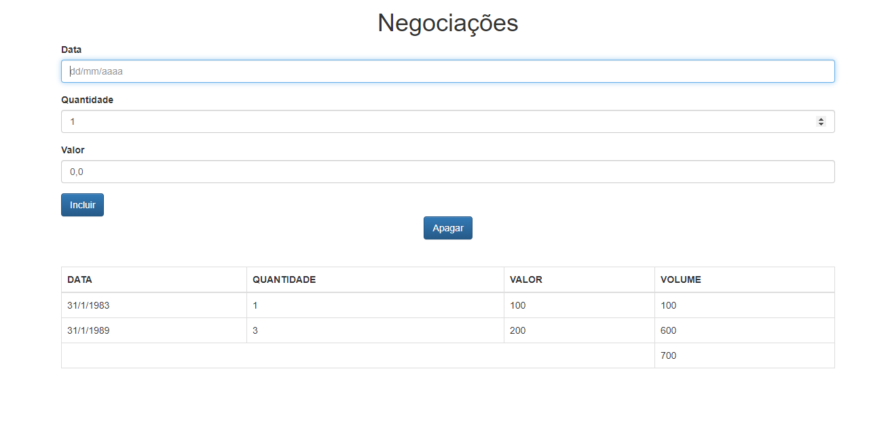

 
 

 
 

# :notebook_with_decorative_cover: Instruções

### :fire: Rodar os comandos abaixo:

:one: Clonar projeto 
`$ git clone https://github.com/MitchellSymington/aluraframe.git`

:two: Ir para o diretório  
`$ cd aluraframe`

:three: Instalar dependencias 
`$ yarn install`
